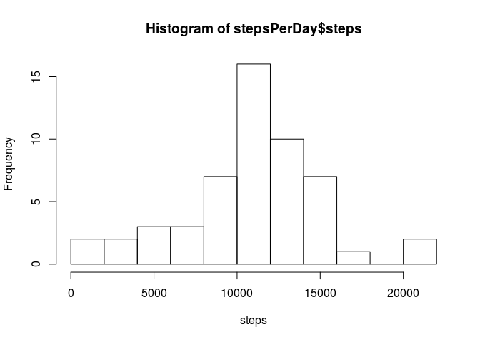
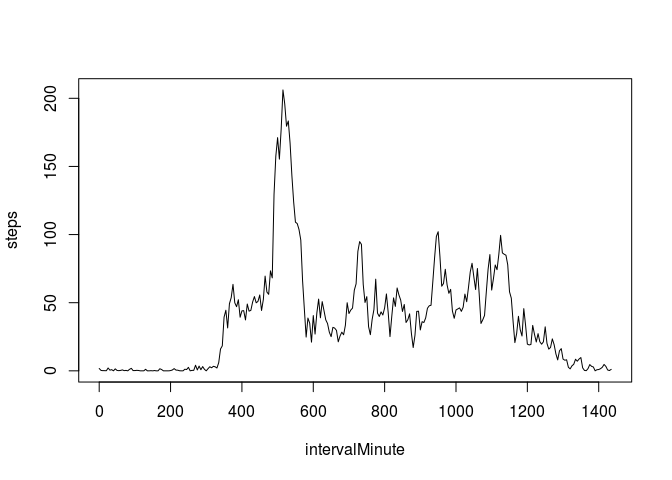
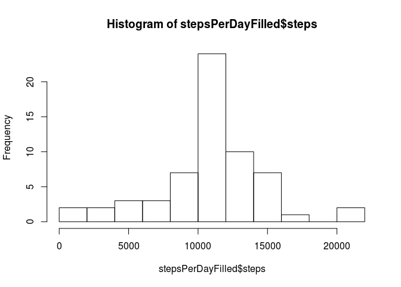
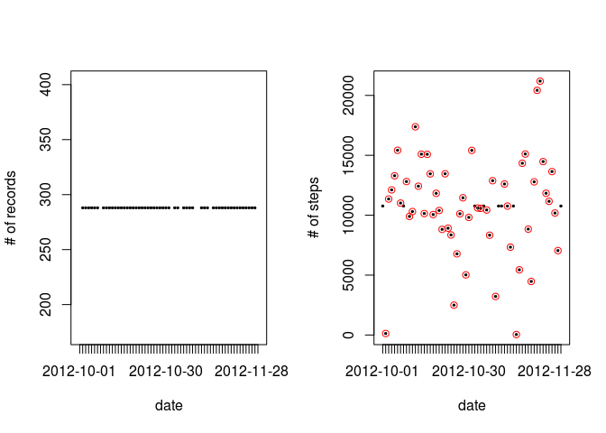
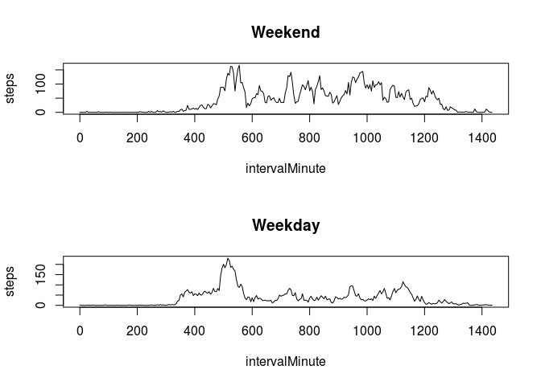
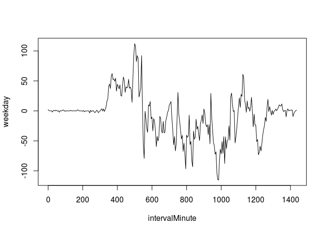

# Reproducible Research: Peer Assessment 1

## Utility functions used


```r
library("kimisc")
library("chron")
intervalHHMM2Minute <- function(x) x %/% 100 * 60 + x %% 100
intervalMinute2HHMM <- function(x) x %/% 60 * 100 + x - x %/% 60 * 60
```

## Loading and preprocessing the data

The original data uses integers in the form of `HHMM` to represent intervals. This approach, however, introduces a 40 wide gap after each hour. As to get my data linear, I'm mapping from the `HHMM` format to `minute-of-the-day` format.

```r
data <- read.csv("activity.csv")
# Convert interval from HHMM format to minute of the day (collapses the skipped 60..99 ranges)
data$intervalMinute <- intervalHHMM2Minute(data$interval)
```

## What is mean total number of steps taken per day?


```r
stepsPerDay <- aggregate(steps ~ date, data, sum)
hist(stepsPerDay$steps, breaks = 10, xlab="steps")
```



The mean of total number of steps taken per day is 1.0766189\times 10^{4}, while the median is 10765.

## What is the average daily activity pattern?


```r
stepsPerInterval <- aggregate(steps ~ intervalMinute, data, mean)
plot(stepsPerInterval, type="l")
```



```r
maxIntervalMinute <- stepsPerInterval$intervalMinute[which.max(stepsPerInterval$steps)]
maxInterval <- intervalMinute2HHMM(maxIntervalMinute)
```

The maximum number of steps on average can be found in the 515 minute (In the original data 835 HHMM interval).


## Imputing missing values

The input contains 2304 missing (`NA`) values.

For further analysis, I will replace `NA` values with the interval average.


```r
dataFilled <- data
dataFilled$steps <- coalesce.na(data$steps, stepsPerInterval$steps[match(data$intervalMinute, stepsPerInterval$intervalMinute)])

stepsPerDayFilled <- aggregate(steps ~ date, dataFilled, sum)
hist(stepsPerDayFilled$steps, breaks = 10)
```



After imputing, the mean of total number of steps taken per day is 1.0766189\times 10^{4}, while the median is 1.0766189\times 10^{4}.

<!-- 4 -->

```r
par(mfrow=c(1,2))
plot(aggregate(steps ~ date, data, length), type="l", ylab="# of records")
plot(aggregate(steps ~ date, dataFilled, sum), type="l", ylab="# of steps", col="black")
points(aggregate(steps ~ date, data, sum), type="p", ylab="# of steps", col="red")
```



Looking at the # of records in the original input, we can see that there are no partial days. We either have all records for one day, or no records at all. Adding in the average intervals leads to having the daily aggregate being equal to the daily mean.

Looking at the number of daily steps before (red circle), and after (black dot) imputing, we can see this, as newly added days all have the same value (dots not in a red circle)

## Are there differences in activity patterns between weekdays and weekends?

<!-- 1 -->

```r
dataFilled$dayType <- ifelse(is.weekend(as.Date(dataFilled$date)), "weekend", "weekday")
```

<!-- 2 -->


```r
stepsPerWeekend <- aggregate(steps ~ intervalMinute, dataFilled[dataFilled$dayType=="weekend",], mean)
stepsPerWeekday <- aggregate(steps ~ intervalMinute, dataFilled[dataFilled$dayType=="weekday",], mean)

par(mfrow=c(2,1))
plot(stepsPerWeekend, type="l", main="Weekend")
plot(stepsPerWeekday, type="l", main="Weekday")
```




```r
weekdayActive <- data.frame(intervalMinute = stepsPerWeekday$intervalMinute, weekday = stepsPerWeekday$steps - stepsPerWeekend$steps)
par(mfrow=c(1,1))
plot(weekdayActive, type="l")
```



Substracting the weekend data from the weekday, we get a compact representation for every interval if it is more actvie during weekdays/weekends.
